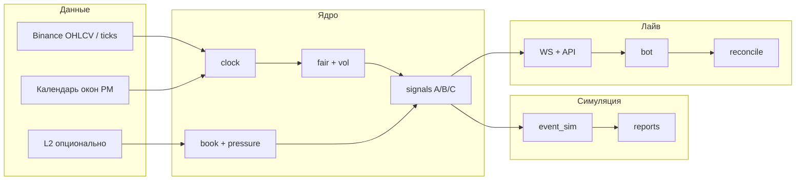

# PM Spot Fair — спецификация проекта с нуля

**Версия:** 2.0 (agent-ready)  
**Назначение:** **единственный входной файл** для человека или AI: прочитать целиком → создать репозиторий `pm-spot-fair` → реализовать по фазам → проверить критерии приёмки в §0.8.

**Как скормить нейросети:** вставьте в чат:

```text
Реализуй проект PM Spot Fair строго по приложенному STRATEGY.md.
Начни с §0 (инструкция агента): фазы 0 → 1 → 1b — полный код, тесты, README, pyproject.toml.
Не переходи к фазе 2+, пока не выполнены все команды из §0.8 для текущей фазы.
Не используй паттерны на z-score/momentum для fair. Holdout-год не использовать для подбора параметров.
Создай новый репозиторий с деревом из §8.
```

---

## 0. Инструкция для AI-агента (читать первым)

### 0.1 Роль

Ты — инженер, который **с нуля** создаёт репозиторий **`pm-spot-fair`**: Python-пакет, CLI, тесты, скрипты данных, market logger без ордеров, затем сим и бот (по фазам).  
Спецификация стратегии — **§1–§18** ниже; **контракты кода** — §0.4–0.7; **приёмка** — §0.8.

### 0.2 Жёсткий порядок фаз (не переставлять)

```text
0 → 1 → 1b → 2 → 3 → 4 → 5 → 6
     ↑
     └── 1 и 1b можно параллельно после 0
```

| Запрещено | Почему |
|-----------|--------|
| Фаза 2+ без зелёных тестов фазы 0 | Нет \(p^\*\) |
| Фаза 2/6 без отчёта 1b go | Неизвестен реальный lag PM |
| Ордера в 1b | Только наблюдение |
| `fair` из momentum/z/EMA | Против §2 |
| Grid search 1000 конфигов под PnL одного года | Против §12 |
| Подбор порогов на holdout-годе (§16) | Переобучение |

**Holdout-год:** последний доступный календарный год в данных — только OOS-прогон **один раз** с зафиксированным конфигом; не использовать в `search_tune`.

### 0.3 Что создать в первом коммите (скелет)

Сразу создать **все пути** из §8 (пустые `__init__.py`, `.gitkeep` в `data/`, `output/`), плюс:

- `pyproject.toml` — §0.5  
- `.gitignore` — §0.6  
- `README.md` — §0.7  
- `.env.example` — §0.7  

Корень репозитория = `pm-spot-fair/`, пакет = `src/pm_spot_fair/`.

### 0.4 Манифест файлов (обязательные)

Каждый файл должен существовать, импортироваться и (где указано) покрываться тестами.

| Путь | Фаза | Назначение |
|------|------|------------|
| `src/pm_spot_fair/fair.py` | 0 | `p_up_gbm`, опционально `p_up_mc` |
| `src/pm_spot_fair/vol.py` | 0–1 | `sigma_ann_from_closes` (EWMA/realized) |
| `src/pm_spot_fair/config.py` | 1 | `ArbConfig`, `MMConfig`, `RebateConfig`, `LoggerConfig` |
| `src/pm_spot_fair/clock.py` | 1 | окна, `tau_sec`, `s0_for_window` |
| `src/pm_spot_fair/spot.py` | 1 | загрузка klines JSON; позже WS |
| `src/pm_spot_fair/pm_book.py` | 1b | mid, microprice, edge |
| `src/pm_spot_fair/book_pressure.py` | 4 | OBI, `p_target`, gaps |
| `src/pm_spot_fair/latency.py` | 1b/6 | метки времени, гистограммы |
| `src/pm_spot_fair/signals_arb.py` | 2 | решение buy/sell/skip |
| `src/pm_spot_fair/signals_mm.py` | 5 | уровни котировок |
| `src/pm_spot_fair/signals_rebate.py` | 6 | лимитки C |
| `src/pm_spot_fair/sim/event_sim.py` | 2 | лаг, спред, PnL |
| `scripts/fetch_binance_klines.py` | 1 | Vision → `data/binance/` |
| `scripts/fetch_pm_windows.py` | 3 | API → `data/pm/windows_*.json` |
| `scripts/reconcile_pm.py` | 6 | сверка лайва |
| `tools/run_calibration.py` | 1 | Brier, reliability |
| `tools/market_logger.py` | 1b | JSONL, без ордеров |
| `tools/analyze_market_logs.py` | 1b | go/no-go отчёт |
| `tools/run_backtest.py` | 2+ | `--sleeve arb\|mm\|rebate` |
| `tools/report.py` | 2+ | агрегат метрик §14 |
| `tests/test_fair.py` | 0 | граничные случаи |
| `tests/test_vol.py` | 1 | σ > 0 |
| `tests/test_clock.py` | 1 | τ убывает к T |
| `bot/order_gateway.py` | 6 | отправка ордеров PM CLOB |
| `bot/main.py` | 6 | WS + engine + gateway |

Заглушки для фаз 4–6 допустимы как `raise NotImplementedError` **до** своей фазы, но **импорт пакета** не должен падать.

### 0.5 `pyproject.toml` (создать целиком)

```toml
[project]
name = "pm-spot-fair"
version = "0.1.1"
requires-python = ">=3.11"
dependencies = [
  "numpy>=1.26",
  "httpx>=0.27",
  "websockets>=12.0",
  "orjson>=3.9",
]

[project.optional-dependencies]
dev = ["pytest>=8.0", "ruff>=0.4"]
analysis = ["pandas>=2.0", "matplotlib>=3.8"]

[tool.pytest.ini_options]
testpaths = ["tests"]

[build-system]
requires = ["hatchling"]
build-backend = "hatchling.build"

[tool.hatch.build.targets.wheel]
packages = ["src/pm_spot_fair"]

[tool.hatch.build.targets.sdist]
include = ["src/pm_spot_fair", "STRATEGY.md"]
```

Установка из корня репо: `pip install -e ".[dev,analysis]"`. Импорты: `from pm_spot_fair.fair import p_up_gbm` (пакет лежит в `src/pm_spot_fair/`).

### 0.6 `.gitignore` (минимум)

```gitignore
.env
.venv/
__pycache__/
output/
data/binance/*.json
data/binance_1m/*.json
data/pm/quotes/
*.jsonl
*.jsonl.gz
.DS_Store
```

### 0.7 `README.md` и `.env.example`

**README.md** (кратко):

- Назначение: PM Spot Fair, механистический \(p^\*\).
- Установка, `pytest`, фазы 0–1b.
- Ссылка: «полная спека — `STRATEGY.md`».

**.env.example`:**

```bash
# Polymarket CLOB (лайв, фаза 6)
PM_API_KEY=
PM_API_SECRET=
PM_PASSPHRASE=
PM_PRIVATE_KEY=

# Опционально: Polygon RPC только для on-chain (не hot path)
POLYGON_RPC_URL=

# Рынок
PM_MARKET_SLUG=btc-updown-5m
BINANCE_SYMBOL=BTCUSDT
```

### 0.8 Критерии приёмки (команды — должны пройти)

**Фаза 0**

```bash
pytest tests/test_fair.py -q
python -c "from pm_spot_fair.fair import p_up_gbm; assert 0.45 < p_up_gbm(s=100,s0=100,tau_sec=300,sigma_ann=0.5) < 0.55"
```

**Фаза 1**

```bash
python scripts/fetch_binance_klines.py --symbol BTCUSDT --years 2024
python tools/run_calibration.py --years 2024 --out output/reports/cal_2024
# В отчёте: Brier < 0.25 (ориентир; хуже 0.5 — провал)
pytest tests/test_vol.py tests/test_clock.py -q
```

**Фаза 1b**

```bash
# Dry-run 60s без ключей, если PM публичен; иначе mock-режим --mock-pm
python tools/market_logger.py --duration-sec 60 --out output/logs/smoke.jsonl --mock-pm
python tools/analyze_market_logs.py --logs output/logs/smoke.jsonl --out output/reports/smoke/
# Отчёт содержит: go/no-go, lag_pm_ms_p50, lag_pm_ms_p95, mean_abs_gap
```

**Фаза 2** (после 1b go)

```bash
python tools/run_backtest.py --sleeve arb --years 2024 --lag-ms <from_1b_report>
```

Агент **останавливается** и пишет пользователю отчёт по фазе, если команда падает.

### 0.9 Контракты функций (реализовать именно так)

**`fair.py`**

```python
def p_up_gbm(*, s: float, s0: float, tau_sec: float, sigma_ann: float) -> float: ...
def p_up_mc(*, s: float, s0: float, tau_sec: float, sigma_ann: float,
            n_paths: int = 10_000, n_steps: int = 50, seed: int = 42) -> float: ...
```

**`vol.py`**

```python
def sigma_ann_from_closes(closes: list[float], *, span: int = 60) -> float: ...
```

**`clock.py`**

```python
@dataclass(frozen=True)
class Window:
    window_id: str
    t0_utc: datetime
    t_end_utc: datetime

def tau_sec(now_utc: datetime, window: Window) -> float: ...
def load_windows(path: Path) -> list[Window]: ...
```

**`pm_book.py`**

```python
def mid_price(best_bid: float, best_ask: float) -> float: ...
def microprice(best_bid: float, best_ask: float, bid_qty: float, ask_qty: float) -> float: ...
def taker_edge_buy_yes(*, p_star: float, ask: float, fee: float) -> float: ...
```

**`book_pressure.py`**

```python
def order_book_imbalance(bid_qtys: list[float], ask_qtys: list[float]) -> float: ...
def p_target(*, p_star: float, tau_sec: float, i_bin: float, delta_bin: float,
             alpha_scale: float = 0.05) -> float: ...
```

**`tools/market_logger.py` CLI**

```text
--symbol BTCUSDT
--pm-market <slug> | --mock-pm
--interval-ms 250
--out PATH
--duration-sec N   # для smoke; без N — бесконечно до Ctrl+C
```

Каждая строка JSONL — поля из §11.4.

**`tools/analyze_market_logs.py` CLI**

Пишет `output/reports/.../summary.md` с блоками §11.7 и `config_recommendation.json`:

```json
{ "lag_pm_ms_p50": 0, "lag_pm_ms_p95": 0, "go_arb": false, "min_edge_suggested": 0.03 }
```

### 0.10 Внешние API (ориентиры для реализации)

| Источник | Назначение | Документация |
|----------|------------|--------------|
| Binance WS | `bookTicker` или depth → \(S_t\) | https://binance-docs.github.io/apidocs/spot/en/#websocket-market-streams |
| Binance Vision | История 5m/1m | https://data.binance.vision/ |
| Polymarket CLOB | стакан, ордера | https://docs.polymarket.com/ |

**`fetch_binance_klines.py`:** CSV в ZIP → JSON-массив `{ "t": ms, "o", "h", "l", "c", "v" }` по одному файлу на год.

**`fetch_pm_windows.py`:** JSON `[{"window_id","t0_utc","t_end_utc","slug"}]`.

**`market_logger.py`:** режим `--mock-pm` генерирует \(p_{\text{mkt}} = p^* +\) синтетический лаг для CI без сети.

### 0.11 `config.py` — значения по умолчанию

```python
@dataclass(frozen=True)
class ArbConfig:
    min_edge: float = 0.03
    min_tau_sec: float = 30.0
    taker_fee: float = 0.01
    sigma_ewma_span: int = 60

@dataclass(frozen=True)
class LoggerConfig:
    interval_ms: int = 250
    sigma_floor_ann: float = 0.15

@dataclass(frozen=True)
class RebateConfig:
    entry_minutes_before: int = 15
    force_flat_minutes_before: int = 1
    entry_offset_from_mid: float = 0.01
    exit_offset_from_mid: float = 0.01
    quote_relative_to_mid: bool = True
    max_mid_deviation: float = 0.04
```

### 0.12 Отчёт агенту по завершении фазы

После каждой фазы вывести пользователю:

1. Список **созданных/изменённых** файлов.  
2. Результат **§0.8** команд (копипаста stdout).  
3. Блокеры (нет API PM, нет данных — что замокано).  
4. Следующая фаза и что нужно от человека (VPS, ключи, неделя логов).

---

## Оглавление

0. **[Инструкция для AI](#0-инструкция-для-ai-агента-читать-первым)** ← реализация с нуля  
1. [Что строим](#1-что-строим)
2. [Чем это не является](#2-чем-это-не-является)
3. [Рынок и правила](#3-рынок-и-правила)
4. [Справедливая вероятность \(p^\*\)](#4-справедливая-вероятность-p)
5. [Событийные часы](#5-событийные-часы)
6. [Три торговых рукава](#6-три-торговых-рукава)
7. [Два стакана: Binance + Polymarket](#7-два-стакана-binance--polymarket)
8. [Структура проекта (с нуля)](#8-структура-проекта-с-нуля)
9. [Глобальный пайплайн](#9-глобальный-пайплайн)
10. [Дорожная карта: фазы 0–6 и 1b](#10-дорожная-карта-фазы-06-и-1b)
11. [Фаза 1b: market logger и анализ недели](#11-фаза-1b-market-logger-и-анализ-недели)
12. [Что настраивать](#12-что-настраивать)
13. [Модули и ответственность](#13-модули-и-ответственность)
14. [Метрики успеха](#14-метрики-успеха)
15. [Риски](#15-риски)
16. [Принципы holdout и валидации](#16-принципы-holdout-и-валидации)
17. [Скорость, стек и RPC](#17-скорость-стек-и-rpc)
18. [Итог](#18-итог)

**Приложения:** [A — fair.py](#приложение-a-минимальный-fairpy-референс) · [B — лайв](#приложение-b-чеклист-перед-лайвом) · [C — логгер](#приложение-c-чеклист-логгер-на-неделю) · **[D — промпт для AI](#приложение-d-готовый-промпт-для-нейросети-копировать-целиком)**

---

## 1. Что строим

**Система** для торговли (или симуляции) бинарных рынков Polymarket вида «BTC Up/Down за 5 минут», опирающаяся на **механизм образования цены**, а не на «в прошлом после такой свечи чаще было X».

Ядро:

| Компонент | Смысл |
|-----------|--------|
| **\(p^\*\)** | Вероятность «Up» из текущего спота BTC, цены на старте окна, времени до конца \(\tau\) и волатильности \(\sigma\) |
| **\(p_{\text{mkt}}\)** | Вероятность из стакана PM (mid / microprice YES) |
| **Сигнал** | PM отстаёт или расходится с \(p^\*\) (и опционально с потоком Binance) → сделка с именованной причиной |
| **Симулятор** | Событийное время \(\tau\), лаг, спред, комиссии — до лайва |
| **Market logger** | Неделя+ наблюдения: спот, PM, \(p^\*\), gap — **без ордеров**, потом анализ |
| **Лайв-бот** | WebSocket Binance + API PM, ордера, сверка (после выводов из 1b) |

Три **рукава** (можно включать по отдельности):

- **A** — арбитраж лага (тейкер).
- **B** — маркет-мейкинг вокруг \(p^\*\) (мейкер).
- **C** — round-trip ликвидность ради **maker rebates**, почти без направления (отдельная логика, общий календарь окон).

---

## 2. Чем это не является

| Подход | Почему не наш путь |
|--------|-------------------|
| Паттерны на OHLCV (fade, breakout, z-score) | Ставка на «будущее = прошлое» |
| Подгонка 1000 пресетов под годовой PnL | Переобучение на один режим |
| Одна ставка на open 5m-свечи Binance | Не совпадает с часами PM и с \(\tau\) внутри окна |
| Усреднение цен Binance и PM в одном стакане | Разные единицы (\$ vs вероятность) |

Наш путь: **контракт + спот + время + (опционально) поток в стакане**.

---

## 3. Рынок и правила

### 3.1 Площадки

- **Polymarket** — торговля токенами YES/NO на исход «BTC выше/ниже на старте 5m-окна» (уточнить точную формулировку resolution в [документации PM](https://docs.polymarket.com/) на момент старта).
- **Binance spot** — источник \(S_t\); в лайве **индекс/оракул PM должен совпадать** с тем, что вы используете для \(S_0\) и \(S_t\), иначе \(p^\*\) систематически смещён.

### 3.2 Упрощённый payoff (для модели)

- **YES (Up):** \$1, если \(S_T > S_0\); иначе \$0.
- **NO:** дополнение к YES (\(p_{\text{NO}} \approx 1 - p_{\text{YES}}\) в эффективном рынке).

\(S_0\) — цена BTC в **момент открытия окна PM** по правилам платформы (не «open случайной свечи Binance», если они не совпадают).

### 3.3 Внешние зависимости (минимум)

- Python 3.11+ (рекомендация).
- `numpy`, `scipy` или чистый `math` для \(\Phi\), MC.
- HTTP/WebSocket: `httpx`, `websockets` или SDK бирж.
- Polymarket CLOB API + ключи кошелька для лайва.
- Опционально: `pytest` для фазы 0.

---

## 4. Справедливая вероятность \(p^\*\)

### 4.1 Вопрос, на который отвечаем

**При текущем BTC и оставшемся времени, каков шанс, что в конце окна цена будет выше \(S_0\)?**

Входы:

| Символ | Смысл |
|--------|--------|
| \(S_t\) | Mid BTC сейчас |
| \(S_0\) | BTC на открытии окна (фиксировано на событие) |
| \(\tau\) | Секунд до конца окна |
| \(\sigma\) | Волатильность (годовая, с согласованными единицами времени) |

### 4.2 Закрытая формула (GBM, v0)

\[
p^\* = \Phi(d_2), \quad
d_2 = \frac{\ln(S_t/S_0) - \frac{1}{2}\sigma^2 \tau_{\text{лет}}}{\sigma \sqrt{\tau_{\text{лет}}}}
\]

\(\tau_{\text{лет}} = \tau_{\text{сек}} / (365{,}25 \times 24 \times 3600)\).

**Интуиция:** уже выше \(S_0\) и мало времени → \(p^\* \to 1\); на \(S_0\) и много времени → ближе к 0,5.

### 4.3 Волатильность \(\sigma\)

- EWMA по секундным/минутным log-return на Binance;
- или realized vol за последние N минут;
- пол \(\sigma_{\min}\), чтобы не ломать формулу в «тишине».

### 4.4 Монте-Карло

Симулируем пути \(S\) от \(S_t\) до \(T\), считаем долю путей с \(S_T > S_0\). Нужен при жирных хвостах, скачках, моделировании **запаздывания PM** в бэктесте. Для старта достаточно закрытой формулы.

### 4.5 Рыночная цена PM

Из стакана YES: mid, microprice; проверка \(p_Y + p_N \approx 1\).

**Исполнение:**

- Покупка YES: `edge = p* - ask_yes - fee`
- Продажа YES: `edge = bid_yes - p* - fee`

---

## 5. Событийные часы

Окно PM: \(t_0\) (открытие), \(T\) (резолв). На каждом шаге \(t\):

```text
τ(t) = (T - t) в секундах
S_0 = спот на t_0 (правило платформы)
S_t = mid Binance (или индекс PM)
σ   = vol_engine(история, τ)
p*  = fair_up(S_t, S_0, τ, σ)
p_mkt = из стакана PM
```

**Календарь окон** — отдельный артефакт данных: список `{slug, t0_utc, T_utc}` (из API PM или парсинга UI).

Окна PM **не обязаны** совпадать с 5m-свечами Binance — на фазе 1 можно грубо приравнять для прототипа, на фазе 3 — только реальный календарь.

---

## 6. Три торговых рукава

| Рукав | Цель | \(p^\*\) |
|-------|------|----------|
| **A — Лаг / согласованность** | PM догоняет спот | Тейкер при edge > 0 |
| **B — MM** | Спред − adverse selection | Котировки \(p^* \pm \delta\); skew от **гаммы** у \(\tau \to 0\) |
| **C — Rebate round-trip** | Ребейты − утечки | Фильтр риска; торговля у ~0.50, flat до окна |

### Рукав C (краткая спецификация в этом же проекте)

За **N минут** до открытия 5m-окна (например 15):

1. Если рынок ещё около 50/50 — лимитки **на обе** ноги (YES и NO) от **mid каждой ноги ± offset** (не одна абсолютная цена 0.49 на оба токена при skew 0.51/0.50).
2. После заполнения пары — лимитки на выход с симметричным offset.
3. **Принудительно flat** за ~1 мин до окна (отмена, при необходимости тейкер).
4. PnL ≈ **rebate × notional** − one-sided fills − спред.

\(p^\*\) для C: **не** для направления, а чтобы **не** ставить rebate-сетку, когда рынок уже 0.65/0.35.

У экспирации (рукава A, B): уменьшать размер, расширять спред, не открывать новый риск в последние N секунд \(\tau\).

---

## 7. Два стакана: Binance + Polymarket

### 7.1 Ошибка

**Нельзя** усреднять цену BTC и цену YES. **Можно** сравнить **давление** (OBI, microprice − mid) на общей шкале «вверх/вниз».

- Binance — где формируется **цена BTC**.
- PM — где торгуют **вероятность** исхода.
- Спот вырос → \(p^\*\) вырос → \(p_{\text{mkt}}\) должен догнать; часто **с задержкой**.

### 7.2 Метрики давления

**Binance:** OBI по уровням стакана; microprice; \(\Delta^{\text{bin}} = (microprice - mid) / mid\).

**PM:** OBI на YES; \(\Delta^{\text{pm}} = p_\mu - p_{\text{mid}}\); проверка YES+NO ≈ 1.

### 7.3 Три вида «пропорциональности»

1. **Уровень:** \(\text{gap}_{\text{уровень}} = p_{\text{mkt}} - p^\*\) (главный, рукав A).
2. **Поток:** \(\text{gap}_{\text{поток}} = \kappa \Delta^{\text{bin}} - \Delta^{\text{pm}}\) (Binance опережает PM).
3. **Динамика:** \(\Delta S > 0\), \(\Delta p_{\text{mkt}} \approx 0\) за 1–5 с.

### 7.4 Целевая вероятность

\[
p^{\text{цель}} = \mathrm{clamp}\bigl(p^\* + \alpha(\tau) \cdot \phi(I^{\text{bin}}, \Delta^{\text{bin}}),\, 0.05,\, 0.95\bigr)
\]

\(\alpha(\tau)\) → 0 у экспирации. PM — **рынок для сделки**, не второй fair.

```text
если p_mkt < p_цель - порог - комиссии → покупаем YES
если p_mkt > p_цель + порог + комиссии → продаём YES / покупаем NO
```

### 7.5 Когда не входить

Мало \(\tau\) и \(p^* \approx 0.95\); широкий спред; мигание OBI; одностороннее исполнение; индекс PM ≠ ваш Binance mid.

### 7.6 Пример

\(S_0=100\,000\), \(S_t=100\,300\), \(\tau=180\) с → \(p^* \approx 0.58\). PM mid = 0.52 → gap уровня. Binance bid-heavy, PM не сдвинулся → gap потока. Ask 0.53, fee 0.01 → edge ≈ 0.04 (если не adverse selection).

---

## 8. Структура проекта (с нуля)

Рекомендуемый **новый репозиторий** (имена папок — пример; можно упростить):

```text
pm-spot-fair/                    # корень репозитория
├── README.md                    # 5 строк: что это + ссылка на STRATEGY.md
├── STRATEGY.md                  # этот файл (или docs/STRATEGY.md)
├── pyproject.toml               # зависимости, pytest
├── .env.example                 # ключи PM, без секретов в git
│
├── data/                        # локальные данные (gitignore больших файлов)
│   ├── binance/
│   │   └── btcusdt_5m_2024.json # OHLCV: t, o, h, l, c, v
│   ├── binance_1m/              # фаза 3+
│   └── pm/
│       ├── windows_btc_5m.json  # {slug, t0, T}
│       └── quotes/              # опционально: снимки L2
│
├── src/
│   └── pm_spot_fair/
│       ├── __init__.py
│       ├── fair.py              # p_up_gbm, p_up_mc
│       ├── vol.py
│       ├── clock.py             # τ, S_0, join окон
│       ├── spot.py              # загрузка S_t из файла/WS
│       ├── pm_book.py           # p_mkt, edge
│       ├── book_pressure.py     # OBI, p_target
│       ├── signals_arb.py       # рукав A
│       ├── signals_mm.py        # рукав B
│       ├── signals_rebate.py    # рукав C
│       ├── config.py            # dataclass пресеты
│       └── sim/
│           └── event_sim.py     # лаг, спред, fills, rebate ledger
│
├── scripts/
│   ├── fetch_binance_klines.py  # Vision ZIP → JSON
│   ├── fetch_pm_windows.py      # API → windows.json
│   └── reconcile_pm.py          # лайв: сделки vs API PM
│
├── tools/
│   ├── run_calibration.py       # фаза 1: Brier, без торговли
│   ├── market_logger.py         # фаза 1b: лайв-наблюдение → JSONL
│   ├── analyze_market_logs.py   # фаза 1b: отчёт после недели логов
│   ├── run_backtest.py          # --sleeve arb|mm|rebate
│   └── report.py                # метрики §14
│
├── tests/
│   └── test_fair.py
│
└── output/                      # gitignore
    ├── reports/
    │   └── <run_id>/
    └── logs/
        └── live_YYYYMMDD.jsonl
```

**Принцип:** один пакет `pm_spot_fair`, тонкие CLI в `tools/`, данные отдельно, отчёты в `output/`.

### 8.1 Откуда брать историю Binance (без API-ключа)

Публичные архивы [data.binance.vision](https://data.binance.vision/):

- Monthly: `.../spot/monthly/klines/BTCUSDT/5m/BTCUSDT-5m-YYYY-MM.zip`
- Daily: для хвоста текущего месяца

Скрипт `fetch_binance_klines.py` распаковывает CSV → JSON по годам.

### 8.2 Откуда брать окна PM

- REST/API Polymarket: активные рынки BTC 5m → `t0`, `T`, `condition_id`.
- Сохранить в `data/pm/windows_*.json` для воспроизводимого бэктеста.

### 8.3 Конфигурация (пример полей)

```python
# config.py — иллюстрация, не обязательный код сейчас
@dataclass
class ArbConfig:
    min_edge: float = 0.02
    min_tau_sec: float = 30.0      # не торговать последние N сек
    taker_fee: float = 0.01
    sigma_ewma_span: int = 60

@dataclass
class RebateConfig:
    entry_minutes_before: int = 15
    force_flat_minutes_before: int = 1
    entry_offset_from_mid: float = 0.01
    quote_relative_to_mid: bool = True
```

---

## 9. Глобальный пайплайн

### 9.1 Схема



### 9.2 Слои данных

| Слой | Содержимое | Когда достаточно |
|------|------------|------------------|
| **L0** | Binance 5m OHLCV | Фаза 0–1: формула + грубая калибровка |
| **L1** | 1m / 1s спот | Фаза 2–3: τ внутри окна, vol |
| **L2** | Календарь PM | Фаза 3: правильные \(S_0\), \(T\) |
| **L3** | L2 Binance + PM | Фаза 4+: поток; лайв |

**Не ждать L3**, чтобы начать: L0 + синтетический PM отвечают на «\(p^\*\) калибруется?» и «есть ли edge на лаге в симе?».

### 9.3 Офлайн-прогон (бэктест)

```text
1. Загрузить klines и (позже) windows.json
2. Для каждого окна [t0, T]:
     задать S_0
     для каждого t:
         τ, S_t, σ → p*
         p_mkt ← сим или исторический стакан
         [опционально] p_цель, сигнал
         записать сделки в sim
     исход = 1[S_T > S_0]
3. Отчёт: §14 (Brier, gap half-life, PnL по рукаву)
4. Сохранить output/reports/<run_id>/
```

**Сначала** прогон **без торговли** (только калибровка \(p^\*\)) — иначе непонятно, торгуете лаг или шум.

### 9.4 Лайв-цикл

```text
1. UTC sync; WS Binance (bookTicker / depth)
2. PM: market id, подписка на стакан YES/NO
3. Каждые 100–500 ms:
     обновить S_t, τ, p*, p_mkt
     фильтры → ордер
4. JSONL-лог каждого решения
5. Ежедневно: reconcile с API PM (fills, rebates)
6. Отчёт §14 + алерты (inventory ≠ 0 к t0 для C)
```

**До торговли:** сначала **фаза 1b** — market logger на VPS 5–10 дней (лучше неделя), без ордеров; см. [§11](#11-фаза-1b-market-logger-и-анализ-недели).

**Старт лайва (фаза 6):** только если 1b ответила «да» на lag и gap; рукав A, минимальный notional.

### 9.5 Пайплайн «сначала слушаем рынок» (фаза 1b)

```text
[Фаза 0] fair.py + тесты
     ↓ параллельно
[Фаза 1] калибровка p* на исторических klines (офлайн)
     ↓ параллельно, нужны 0 + fair в логгере
[Фаза 1b] market_logger.py на VPS 5–10 дней → JSONL
     ↓
analyze_market_logs.py → отчёт (lag, gap, Brier live, go/no-go)
     ↓ если go
[Фаза 2] сим с lag_pm_ms из p95 логов
     ↓
[Фаза 6] малые ордера + latency в логе
```

**Ошибка:** сразу писать бота с ордерами без недели наблюдений — вы не знаете реальный лаг PM и размер gap.

### 9.6 Три контура разработки

| Контур | Вопрос | Не делать |
|--------|--------|-----------|
| **Research** | Верен ли \(p^\*\)? | Оптимизировать годовой баланс |
| **Execution sim** | Edge после fees и лага? | Grid 1000 параметров под один год |
| **Ops** | Бот стабилен, логи сходятся? | Менять fair без повторной калибровки |

---

## 10. Дорожная карта: фазы 0–6 и 1b

Каждая фаза заканчивается **артефактом** и **критерием выхода**. Следующая не начинается без него.

**Практичный старт для лайв-гипотезы:** фазы **0 + 1b** (формула + недельный логгер) можно вести **параллельно**; фаза **1** (офлайн klines) не заменяет 1b и наоборот.

### Фаза 0 — Математика \(p^\*\) (без PM, без торговли)

**Создать:** `fair.py`, `vol.py` (заглушка σ=const), `tests/test_fair.py`.

**Проверить:**

- \(S_t = S_0\), большой \(\tau\) → \(p^* \approx 0.5\)
- \(S_t \gg S_0\), малый \(\tau\) → \(p^* \to 1\)

**Команда (после создания репо):**

```bash
pytest tests/test_fair.py -q
```

---

### Фаза 1 — Калибровка на истории Binance (без торговли)

**Создать:** `scripts/fetch_binance_klines.py`, `clock.py` v0 (окно = одна 5m-свеча: \(S_0=\) open, исход = close > open), `tools/run_calibration.py`.

**Критерий выхода:** Brier score \(p^\*\) **лучше**, чем константа 0.5, на 2–3 годах train; график reliability (бины по \(p^\*\)).

**Данные:** скачать 5m klines BTCUSDT с Binance Vision.

```bash
python scripts/fetch_binance_klines.py --symbol BTCUSDT --years 2023 2024 2025
python tools/run_calibration.py --years 2023 2024 2025
```

---

### Фаза 1b — Market logger (наблюдение, без ордеров)

Кратко: см. полное описание в [§11](#11-фаза-1b-market-logger-и-анализ-недели).

**Создать:** `tools/market_logger.py`, `tools/analyze_market_logs.py`, конфиг рынка PM (slug / condition_id).

**Запуск:** VPS, 5–10 дней (ориентир — **неделя**), только запись JSONL.

**Критерий выхода:** отчёт `analyze_market_logs` с go/no-go для сима и лайва; зафиксированы `lag_pm_ms` (p50/p95), частота больших gap, Brier \(p^\*\) на реальных окнах.

```bash
python tools/market_logger.py --out output/logs/market_2026-01.jsonl
# через неделю:
python tools/analyze_market_logs.py --logs output/logs/market_2026-01.jsonl --out output/reports/market_week1/
```

**Не начинать фазу 2/6**, если 1b показала: gap почти нет, схлопывается быстрее вашей будущей латентности, или \(p^\*\) не калибруется на live-окнах.

---

### Фаза 2 — Синтетический PM + рукав A

**Создать:** `sim/event_sim.py` ( \(p_{\text{mkt}} = p^* + \text{lag}(\Delta S) + \epsilon\), bid/ask ), `signals_arb.py`, `tools/run_backtest.py --sleeve arb`.

**Критерий выхода:** `lag_pm_ms` в симе взят из **p95 tick→recv PM** (или эквивалент) фазы 1b; при разумном лаге edge в симе ≥ 0; метрики gap half-life из §14.

```bash
python tools/run_backtest.py --sleeve arb --years 2024 2025 --lag-ms 500 --spread 0.02
```

---

### Фаза 3 — Реальный календарь PM

**Создать:** `scripts/fetch_pm_windows.py`, доработать `clock.py` (join PM \(t_0, T\) с 1m klines).

**Критерий выхода:** \(S_0\) сверен с правилами PM; Brier не хуже фазы 1.

```bash
python scripts/fetch_pm_windows.py --out data/pm/windows_btc_5m.json
python tools/run_calibration.py --pm-windows data/pm/windows_btc_5m.json
```

---

### Фаза 4 — Стаканы и \(p^{\text{цель}}\)

**Создать:** `book_pressure.py`, запись L2 в лайве (`output/logs/`), доработка рукава A.

**Критерий выхода:** на записанных данных \(\text{gap}_{\text{поток}}\) улучшает предсказание \(\Delta p_{\text{mkt}}\) vs только \(p^\*\).

---

### Фаза 5 — MM (рукав B)

**Создать:** `signals_mm.py`, котировки \(p^* \pm \delta\), inventory skew, force-flat по \(\tau\).

**Критерий выхода:** в симе не хуже наивного mid; контроль DD у экспирации.

```bash
python tools/run_backtest.py --sleeve mm --years 2024 2025
```

---

### Фаза 6 — Лайв

**Создать:** `bot/main.py`, `bot/order_gateway.py`, `latency.py` (таймстампы §17.2), `scripts/reconcile_pm.py`, рукав C по желанию.

**Критерий выхода:** логи = API PM; **p95 tick→ack** измерен и согласован с `lag_pm_ms` в симе; для C: trading PnL/event ≈ 0, rebate > leakage.

```bash
python -m bot.main --sleeve arb --dry-run false --max-usd 5
python scripts/reconcile_pm.py --date 2026-01-15
# отчёт: p50/p95 latency из output/logs/latency_*.jsonl
```

### Сводка фаз

| Фаза | Торгуем? | Данные | Главный вопрос |
|------|----------|--------|----------------|
| 0 | Нет | — | Формула верна? |
| 1 | Нет | 5m Binance (офлайн) | \(p^*\) на истории? |
| **1b** | **Нет (только лог)** | **WS Binance + котировки PM** | **Реальный lag и gap на живом рынке?** |
| 2 | Сим | 5m + synth PM + выводы 1b | Edge на лаге в симе? |
| 3 | Сим | PM calendar + 1m | Верные \(S_0\), \(\tau\)? |
| 4 | Сим/логи | + L2 | Поток помогает? |
| 5 | Сим | то же | MM ок? |
| 6 | Лайв | WS + API + ордера | PnL и latency? |

---

## 11. Фаза 1b: market logger и анализ недели

Это отдельный **обязательный** этап между «формула на бумаге» и «бот с ордерами». Вы **не торгуете** — вы **записываете**, как ведут себя спот, \(p^\*\) и Polymarket, чтобы потом принять решение: есть ли вообще лаг-арб и с какими параметрами симулятор.

### 11.1 Зачем неделя логов

| Вопрос | Без логгера | С логгером |
|--------|-------------|------------|
| PM отстаёт от спота? | Гадание | Измеренный lag, half-life gap |
| Какой `lag_pm_ms` в симе? | Произвольный | p50/p95 из данных |
| \(p^\*\) калибруется на **реальных** окнах? | Только офлайн-свечи | Brier по live-окнам |
| Стоит ли рукав A? | — | go / no-go |
| Нужен ли поток (стакан)? | — | Корреляция gap_flow → Δp_mkt |

Одна спокойная неделя на рынке **не** покрывает все режимы, но уже отсекает «идеи, которых нет в данных» и даёт порядок величин для §17 (латентность при переходе к ордерам).

### 11.2 Что должно быть готово до запуска логгера

- [ ] **Фаза 0:** `fair.py` считает \(p^\*\) (хотя бы GBM + const σ или простая EWMA).
- [ ] **Календарь окон** v0: API PM или ручной `windows.json` с \(t_0, T\) для BTC 5m.
- [ ] **Правило \(S_0\):** откуда берёте цену на открытии окна (документация PM + ваш Binance mid в \(t_0\)).
- [ ] VPS с chrony, стабильный интернет (§17 — для качества таймстампов в логе).
- [ ] Доступ к **котировкам** PM (CLOB WS/REST) — торговые ключи не обязательны, если хватает публичного стакана.

**Параллельно** можно гонять фазу 1 на архиве Binance — это **другой** срез, не замена 1b.

### 11.3 Что делает `market_logger.py`

Один процесс, цикл каждые **100–500 ms** (или на каждый tick Binance bookTicker):

1. Обновить \(S_t\) с Binance WS.
2. Определить активное окно PM → \(\tau\), \(S_0\).
3. Посчитать \(\sigma\) и \(p^\*\).
4. Прочитать стакан PM → \(p_{\text{mkt}}\), bid/ask YES (и опционально NO).
5. Посчитать `gap_level`, [опционально] OBI и `gap_flow`.
6. Дописать **одну строку JSONL** в файл (без блокирующего I/O в будущем — буфер + flush раз в N сек).

**Явно не делает:** ордера, подписи, blockchain RPC, reconcile.

### 11.4 Схема строки JSONL (минимум)

Каждая строка — один снимок (пример полей):

```json
{
  "ts_utc": "2026-01-15T12:34:56.123Z",
  "ts_binance_event": "2026-01-15T12:34:56.100Z",
  "ts_recv": "2026-01-15T12:34:56.121Z",
  "window_id": "btc-5m-...",
  "tau_sec": 142.0,
  "s0": 100250.5,
  "s_t": 100312.0,
  "sigma_ann": 0.55,
  "p_star": 0.58,
  "p_mkt_mid": 0.52,
  "p_mkt_micro": 0.521,
  "yes_bid": 0.51,
  "yes_ask": 0.53,
  "gap_level": -0.06,
  "i_bin": 0.12,
  "i_pm": 0.02,
  "gap_flow": 0.08,
  "spread_pm": 0.02,
  "outcome_pending": true
}
```

После закрытия окна — отдельная строка `type: "settle"` с `outcome_up: true/false` и финальным \(S_T\) по правилам PM.

**Объём:** BTC 5m, 2 Hz → порядка **сотен тысяч** строк в неделю; gzip по дням (`market_2026-01-15.jsonl.gz`).

### 11.5 Инфраструктура логгера

| Компонент | Рекомендация |
|-----------|----------------|
| Процесс | Один `market_logger.py`, systemd/supervisor, автоперезапуск |
| Feeds | Binance WS `bookTicker` или top-of-book; PM — WS стакана если есть |
| Диск | Ротация по дню; мониторинг свободного места |
| Падение WS | Логировать `feed_gap_sec`; **не** интерполировать \(p_{\text{mkt}}\) |
| Секреты | Не нужны для read-only; если API требует ключ — только read |

Таймстампы (§17): на 1b минимум `ts_binance_event`, `ts_recv`; полный `tick→order` появится в фазе 6.

### 11.6 Сколько крутить

| Срок | Когда достаточно |
|------|------------------|
| 3–5 дней | Пилот: логгер не падает, поля заполнены |
| **7–10 дней** | Основной отчёт: lag, gap, калибровка |
| 2+ недели | Если неделя была аномально тихой |

Цель — захватить **несколько сотен** закрытых 5m-окон с полным циклом внутри окна.

### 11.7 Что делает `analyze_market_logs.py` (после сбора)

Вход: папка или glob `market_*.jsonl*`. Выход: `output/reports/market_week1/` (markdown + csv + png по желанию).

**Обязательные блоки отчёта:**

1. **Калибровка \(p^\*\)** на settle-строках: Brier, reliability bins (сравнить с фазой 1 офлайн).
2. **Распределение `gap_level`:** гистограмма, доля времени \(|gap| > 0.02, 0.05, 0.08\).
3. **Half-life gap:** после \(|gap| > \theta\), через сколько секунд \(|gap| < \theta/2\).
4. **Лаг spot → PM:** кросс-корр \(\Delta S\) и \(\Delta p_{\text{mkt}}\) при лагах 0…3 s → оптимальный сдвиг.
5. **Рекомендация `lag_pm_ms` для сима:** например p95 задержки «спот двинулся → mid PM сдвинулся».
6. **Поток (если есть OBI):** прирост R² или hit-rate для знака \(\Delta p_{\text{mkt}}\).
7. **Go / no-go:**
   - **Go** для фазы 2: gap бывает, живёт дольше целевой латентности (например > 300 ms), \(p^\*\) не хуже случайного.
   - **No-go:** gap редкий или мгновенный, \(p^\*\) систематически смещён (проверить \(S_0\), индекс).

**Гипотетические сделки (опционально):** «если бы покупали YES при `gap_level < -min_edge`» — только **mark-to-settle**, без комиссий сначала, потом с fee; это не PnL бота, а верхняя оценка идеи.

### 11.8 Решения после анализа (куда идти дальше)

| Вывод 1b | Следующий шаг |
|----------|----------------|
| Lag есть, gap достаточный, \(p^\*\) ок | Фаза 2: сим с `lag_pm_ms` из отчёта |
| \(p^\*\) плохой, gap ок | Чинить vol / \(S_0\) / индекс, повторить 1b |
| Gap есть, но < 200 ms всегда | Ускорять инфра (§17) или отказаться от рукава A |
| Поток не помогает | Рукав A только по `gap_level`; фазу 4 отложить |
| Всё слабое | Не строить лайв-арб; возможно только рукав C (ребейты) |

### 11.9 Команды и файлы

```bash
# Запуск (на VPS, в screen/tmux)
python tools/market_logger.py \
  --symbol BTCUSDT \
  --pm-market <slug_or_id> \
  --interval-ms 250 \
  --out output/logs/market_%Y-%m-%d.jsonl

# Анализ
python tools/analyze_market_logs.py \
  --logs "output/logs/market_*.jsonl*" \
  --out output/reports/market_week1/
```

### 11.10 Чеклист «неделя прошла»

- [ ] < 1% пропусков WS (по длительности сессии)
- [ ] Settle-строки для большинства окон
- [ ] Отчёт go/no-go сохранён
- [ ] `lag_pm_ms` для сима записан в `config` / README прогона
- [ ] Понятно, совпадает ли индекс PM с Binance mid (нет вечного смещения gap)

---

## 12. Что настраивать

| Можно (узко) | Нельзя |
|--------------|--------|
| Окно EWMA для \(\sigma\) | Сотни комбинаций «паттерн» lookback |
| `min_edge`, запрет последних N сек \(\tau\) | Grid под максимальный баланс одного года |
| Параметры сима: лаг ms, спред | «Подглядывание» в holdout-год |
| \(\alpha(\tau)\) после фазы 4 | |

Метод: **walk-forward** по кварталам; цель — Brier, calibration, mean edge — не compounded equity на train.

---

## 13. Модули и ответственность

| Модуль | Вход | Выход | Фаза |
|--------|------|-------|------|
| `fair.py` | \(S_t, S_0, \tau, \sigma\) | \(p^*\) | 0 |
| `vol.py` | returns | \(\sigma\) | 0–1 |
| `clock.py` | UTC, windows | \(S_0\), \(\tau(t)\) | 1–3 |
| `spot.py` | files / WS | \(S_t\) | 1+ |
| `pm_book.py` | L2 PM | \(p_{\text{mkt}}\), edge | 2+ |
| `book_pressure.py` | L2 оба | \(p^{\text{цель}}\), gaps | 4 |
| `signals_arb.py` | fair, market | action | 2+ |
| `signals_mm.py` | fair, inventory | quotes | 5 |
| `signals_rebate.py` | clock, mids | limits | 6 |
| `sim/event_sim.py` | actions | fills, PnL | 2+ |
| `tools/market_logger.py` | WS feeds | JSONL | 1b |
| `tools/analyze_market_logs.py` | JSONL | отчёт go/no-go | 1b |

---

## 14. Метрики успеха

| Метрика | Зачем |
|---------|--------|
| **Brier / calibration** | \(p^\*\) честная вероятность? |
| **Reliability bins** | Не врём ли в хвостах 0.2 / 0.8 |
| **Gap half-life** | PM закрывает lag? |
| **Lead: spot → PM** | Кросс-корр с лагом |
| **Flow lead** | \(\text{gap}_{\text{поток}}\) → \(\Delta p_{\text{mkt}}\) |
| **Trade calibration** | Покупки ниже \(p^\*\) выигрывают чаще цены? |
| **Rebate sleeve** | PnL/event ≈ 0, rebate − leakage > 0 |
| **Gamma PnL (MM)** | Не платим ли adverse selection у \(\tau \to 0\) |

**Не** главный KPI: красивая equity curve на одном годе с реинвестированием.

---

## 15. Риски

1. Индекс резолва PM ≠ ваш Binance mid.  
2. \(\sigma\) занижена у экспирации.  
3. Gap = informed flow, не лаг.  
4. Комиссии > edge.  
5. Спуф OBI на Binance.  
6. One-sided fill на rebate.  
7. Смена правил PM / rebate program.

---

## 16. Принципы holdout и валидации

При появлении нескольких лет данных:

1. Выделить **последний год** (или полгода) как **OOS**: на нём **не** подбирают пороги, vol window, \(\alpha\).
2. Train: калибровка \(p^\*\), оценка типичного лага в симе, walk-forward по кварталам.
3. OOS: один прогон с зафиксированным конфигом → отчёт §14.
4. Лайв: отдельный журнал; сравнение с OOS-симом ежемесячно.

Если OOS ломается — сначала проверить **\(S_0\), \(\sigma\), fees**, потом добавлять сложность (MC, поток), а не крутить grid.

---

## 17. Скорость, стек и RPC

Для **рукава A** (лаг / расхождение стаканов) и частично **рукава B** (MM) вы правы: **edge — это время**. Gap между \(p^\*\) и \(p_{\text{mkt}}\) живёт секунды, иногда сотни миллисекунд. Кто позже отправил ордер на PM, тот покупает уже **догнанный** рынок или попадает под **adverse selection**. Это не HFT на бирже фьючерсов, но это **систематическая инженерия задержек**, а не «написали бота на Python и забыли».

Для **рукава C** (ребейты за 15 минут до окна) скорость **менее критична**; там важнее надёжность парных fill и reconcile. Ниже — разделение по рукавам и что закладывать в проект **с фазы 6**, а измерения — **с первого лайв-пилота**.

### 17.1 Почему латентность — часть стратегии, а не «оптимизация потом»

| Рукав | Чувствительность к скорости | Почему |
|-------|---------------------------|--------|
| **A — лаг-арб** | **Критическая** | Сигнал = временное несоответствие; PM и другие боты **схлопывают** gap |
| **B — MM** | **Высокая** | Нужны быстрый **cancel/replace**, реакция на \(\Delta S\) и inventory; иначе вас «проедают» |
| **C — rebate** | **Умеренная** | Лимитки заранее; важнее **корректность** и flat к окну, не миллисекунды |

Если в симуляторе (фаза 2) заложен лаг PM 500 ms, а ваш бот реально ходит на PM за 2 s — вы **торгуете другую стратегию**, чем в отчёте.

**Правило:** в бэктесте параметр `lag_pm_ms` должен быть **≤ измеренного p95** вашего `tick_to_order_ack` на PM в лайве, иначе сим врёт в вашу пользу.

### 17.2 Бюджет задержки (цепочка одного решения)

Один цикл «увидели движение спота → выставили ордер на PM»:

```text
T0  Binance: событие в стакане / сделка / bookTicker
T1  Сеть до вашего процесса (WS)
T2  Парсинг, обновление S_t, τ, σ
T3  Расчёт p*, p_mkt, gap, фильтры
T4  Формирование и подпись ордера (если нужна)
T5  Сеть до API Polymarket (CLOB)
T6  Ack / reject от матчера
T7  Fill (или частичный / в очереди)
```

**Что логировать обязательно** (монотонные часы, UTC с микросекундами):

| Метка | Смысл |
|-------|--------|
| `t_binance` | Время события с биржи (из payload) |
| `t_recv_binance` | Когда получили в процессе |
| `t_p_star` | После расчёта fair |
| `t_signal` | Решение buy/sell/skip |
| `t_order_sent` | HTTP/WS запрос ушёл |
| `t_order_ack` | Ответ API |
| `t_fill` | Исполнение |

Производные: `t_recv - t_binance` (сеть+биржа), `t_order_sent - t_signal` (ваш код), `t_ack - t_order_sent` (PM + сеть), **полный** `t_fill - t_binance`.

Без этой разбивки нельзя понять, **где** тормозит: Binance feed, Python, подпись, RPC/API PM.

### 17.3 Какой порядок величин ожидать (не обещание, а план измерений)

Для лаг-арба на PM 5m типично (сильно зависит от региона VPS и API):

| Узел | Ориентир для «нормально» | Плохо |
|------|--------------------------|-------|
| Binance WS → процесс | 1–30 ms | > 100 ms стабильно |
| Расчёт \(p^*\) + gap | < 1 ms (простая формула) | > 10 ms в hot path |
| PM: запрос → ack | 50–300 ms | > 500 ms p95 |
| Полный цикл до ack | 100–500 ms | > 1 s при «срочном» сигнале |

Это **не** микросекундный HFT: конкурируете с другими, кто ловит **тот же** lag. Цель — быть **быстрее медианы** и стабильнее по p95, а не обогнать Jump Trading.

### 17.4 Где здесь RPC (и чем он не является)

Скорее всего, вы имели в виду **RPC** (Remote Procedure Call / нода блокчейна), не «PRC».

**Два разных мира:**

| Канал | Для чего | В hot path лаг-арба? |
|-------|----------|----------------------|
| **Polymarket CLOB API** (REST / WebSocket) | Котировки, выставление, отмена лимиток | **Да** — это основной путь сделки |
| **Blockchain RPC** (Polygon и т.д.) | Подпись on-chain, approve, redeem, merge, вывод | **Обычно нет** в момент тейкера |

**Практика:**

- **Торговля (A, B):** минимизировать round-trip к **CLOB API**; держать **постоянное** соединение (HTTP keep-alive / WS), не открывать новый TCP на каждый тик.
- **On-chain (редко в горячем пути):** если нужен approve или settlement — делать **заранее** (фоновый воркер), с **платным** low-latency RPC (Alchemy, QuickNode, …), не публичный бесплатный endpoint с rate limit и 2 s ответом.
- **Не смешивать** в одном потоке: «увидели gap → ждём eth_call → отправили ордер». On-chain только для **подготовки** кошелька и **после** сессии.

Если PM для части операций требует подписи EIP-712:

- Подпись **в памяти**, ключ в secure env;
- По возможности **заранее** построенные шаблоны ордеров (меняется только price/size/nonce);
- Отдельный лёгкий модуль `signer`, без тяжёлого импорта в feed loop.

### 17.5 Технологии: что для чего (не «всё на Rust с дня один»)

| Слой | Допустимо на старте | Когда ужесточать |
|------|---------------------|------------------|
| Research, калибровка, бэктест | **Python** | Фазы 0–5 |
| Симулятор | Python | Пока нет лайва |
| **Hot path лайва** (feed → signal → order) | Python + `asyncio` / **uvloop**, orjson | Фаза 6 пилот |
| Hot path при p95 > целевого | **Rust / Go** отдельный `order_gateway` | После профилирования: узкое место — код, не сеть |
| MM cancel/replace | Тот же gateway, приоритетная очередь | Рукав B |

**Принцип:** сначала **измерить** на Python; переписывать на Rust только если `t_order_sent - t_signal` даёт значимую долю полной задержки (часто узкое место — **PM API или география**, не CPU).

**Что реально ускоряет в Python hot path:**

- Один процесс (или feed + gateway через **shared memory / Unix socket**), без тяжёлого IPC на каждый тик.
- **WebSocket** Binance (`bookTicker` или top-of-book), не REST poll раз в 100 ms.
- Стакан PM — WS / подписка, не опрос mid раз в секунду для рукава A.
- Предаллоцированные буферы, без логирования в hot path (лог — **ring buffer**, сброс в другой поток).
- `orjson` / msgpack; без pandas в цикле.
- Фиксированный набор рынков (один BTC 5m), без динамического discovery в hot path.

**Что ускоряет инфраструктуру:**

- VPS в регионе с **минимальным RTT** до PM API **и** приемлемым до Binance (часто компромисс: US-East для PM + отдельный feed relay или второй легкий инстанс только для Binance — **измерить оба**).
- Синхронизация времени: **chrony**, мониторинг drift.
- Не гонять бота с ноутбука через Wi‑Fi.

### 17.6 Архитектура процессов (рекомендация для лайва)

```text
[feed_binance]  --WS-->  ring buffer  --+
                                        v
[feed_pm]       --WS-->  ring buffer  --> [engine: p*, gap, signals]
                                        |
                                        v
                                 [order_gateway] --HTTP/WS--> Polymarket CLOB
                                        |
                                 [logger_async] --> JSONL / metrics
```

- **engine** — только детерминированная математика и правила; без disk I/O.
- **order_gateway** — rate limit, retry, idempotency, «не слать дважды на один gap».
- **logger** — отдельно, чтобы `print` не стопорил сигнал.

Для рукава **B** gateway должен поддерживать **быстрый cancel_all / replace** при \(\Delta S\) или при \(\tau < \tau_{\min}\).

### 17.7 Сеть и API: чеклист

- [ ] Замер RTT: `ping` / TLS handshake к хостам PM CLOB и Binance из **того же** VPS, где будет бот.
- [ ] WebSocket reconnect с экспоненциальной задержкой, **не** блокировать engine.
- [ ] HTTP: connection pool, `keep-alive`, таймауты раздельно connect vs read.
- [ ] Обработка **429 / rate limit** PM: очередь, не спамить повтором в hot path.
- [ ] Резервный канал: если WS PM упал — **не** торговать тейкером «вслепую» по устаревшему mid.
- [ ] Секреты: env / vault; **никогда** в JSONL лог.

### 17.8 Как встроить в дорожную карту (§10)

| Фаза | Латентность |
|------|-------------|
| 0–5 | Не критично; в симе явно параметр `lag_pm_ms` |
| 6 пилот | Минимальный бот + **полные таймстампы** §17.2; замер p50/p95 |
| 6+ | Сравнить p95 с `lag_pm_ms`; при необходимости uvloop / Rust gateway |
| B / MM | Отдельный KPI: `cancel_ack` latency |

**Новые артефакты в репозитории:**

```text
src/pm_spot_fair/latency.py      # метки, гистограммы
bot/order_gateway.py
docs/LATENCY.md                  # опционально: результаты замеров по датам
output/logs/latency_YYYYMMDD.jsonl
```

### 17.9 Метрики латентности (дополнение к §14)

| Метрика | Зачем |
|---------|--------|
| p50 / p95 `tick_to_ack` | Реалистичный лаг для сима |
| p95 `tick_to_fill` | Для тейкера |
| Доля сигналов, где gap закрылся **до** ack | Сколько edge «сгорело» |
| Slippage: цена fill vs цена на `t_signal` | Adverse selection |
| Uptime WS Binance / PM | Пропуски = ложные lag |

### 17.10 Когда не гнаться за скоростью

- Калибровка \(p^\*\) офлайн — **любой** удобный стек.
- Рукав C — оптимизировать **надёжность** парных ног и reconcile, не микросекунды.
- Пока нет доказанного edge в симе — **бессмысленно** colocation и Rust.

**Итог по сути:** для pm_spot_fair **механика цены** задаёт *что* покупать; **латентность** задаёт *успеете ли* купить ошибку рынка. RPC блокчейна — вспомогательный канал; **горячий путь** — быстрый feed Binance + быстрый **CLOB PM** + честные замеры в логах.

---

## 18. Итог

**С чистого листа вы строите:**

1. **Калькулятор** \(p^\*\) из спота, времени и vol.  
2. **Market logger** (фаза 1b): неделя наблюдений → анализ → go/no-go.  
3. **Календарь** окон PM и join со спотом.  
4. **Симулятор** с лагом из логов и комиссиями.  
5. **Сигналы** лага / MM / rebate и **лайв** с ордерами и сверкой.

**Два стакана** — не смешение цен, а проверка: давление и движение на Binance **согласованы** с PM; при расхождении торгуем на PM в сторону **спота + \(p^\*\)** (+ опционально поток), с исполнимым edge.

**Порядок работ:** фаза 0 → параллельно 1 (офлайн) и **1b (недельный логгер)** → анализ → фаза 2 (сим) → … → лайв (§17). Этот файл — единственная спецификация для нового репозитория.

---

## Приложение C. Чеклист «логгер на неделю»

- [ ] `fair.py` работает, в лог пишется `p_star`
- [ ] `market_logger.py` на VPS, autorestart
- [ ] Ротация логов по дням, место на диске
- [ ] Через 7–10 дней: `analyze_market_logs.py` → go/no-go
- [ ] `lag_pm_ms` перенесён в конфиг для фазы 2
- [ ] Не начинали фазу 6 до отчёта 1b

---

## Приложение A. Минимальный `fair.py` (референс)

```python
import math

def _norm_cdf(x: float) -> float:
    return 0.5 * (1.0 + math.erf(x / math.sqrt(2.0)))

SEC_PER_YEAR = 365.25 * 24 * 3600

def p_up_gbm(*, s: float, s0: float, tau_sec: float, sigma_ann: float) -> float:
    if tau_sec <= 0:
        return 1.0 if s > s0 else (0.0 if s < s0 else 0.5)
    if s0 <= 0 or s <= 0 or sigma_ann <= 0:
        raise ValueError("s, s0, sigma_ann must be positive")
    tau_y = tau_sec / SEC_PER_YEAR
    d2 = (math.log(s / s0) - 0.5 * sigma_ann**2 * tau_y) / (sigma_ann * math.sqrt(tau_y))
    return _norm_cdf(d2)
```

## Приложение B. Чеклист перед лайвом

- [ ] Правила resolution PM прочитаны и закодированы в `clock.py`
- [ ] \(S_0\) на тестовом окне совпал с PM post-factum
- [ ] Brier на holdout приемлем
- [ ] Сим-лаг (`lag_pm_ms`) из отчёта **1b** (§11), согласован с p95 при наличии ордеров (§17)
- [ ] `min_edge` покрывает fee + проскальзывание + типичный slippage
- [ ] VPS: RTT до Binance WS и PM CLOB замерен; не домашний Wi‑Fi
- [ ] Hot path: WS feeds, без REST poll mid; логи не в critical path
- [ ] CLOB vs chain RPC: торговля через API; on-chain только preload
- [ ] Force-flat и max inventory для C
- [ ] Reconcile скрипт проверен на paper/small size
- [ ] Kill-switch: стоп при расхождении лога и API / обрыве WS

---

## Приложение D. Готовый промпт для нейросети (копировать целиком)

```text
Ты — senior Python engineer. Реализуй проект PM Spot Fair с нуля по приложенному файлу STRATEGY.md (версия 2.0 agent-ready).

Правила:
1. Прочитай STRATEGY.md целиком; начни с §0 (инструкция агента).
2. Создай новый репозиторий pm-spot-fair с деревом §8, pyproject.toml §0.5, .gitignore §0.6, README §0.7, .env.example §0.7.
3. Реализуй фазы строго по порядку: 0 → 1 → 1b. Не начинай фазу 2+, пока не выполнены все команды §0.8 для текущей фазы.
4. fair = только p_up_gbm / p_up_mc от (S_t, S_0, tau, sigma). Запрещены z-score, momentum, EMA для fair.
5. Фаза 1b: market_logger.py пишет JSONL без ордеров; analyze_market_logs.py — отчёт go/no-go; поддержи --mock-pm для CI.
6. После каждой фазы: список файлов, вывод команд §0.8, блокеры.

Фаза 0 сейчас:
- src/pm_spot_fair/fair.py (p_up_gbm + p_up_mc)
- src/pm_spot_fair/vol.py (заглушка sigma)
- tests/test_fair.py
- pytest green

Затем фаза 1:
- scripts/fetch_binance_klines.py (Binance Vision → JSON)
- clock.py, spot.py, run_calibration.py, tests

Затем фаза 1b:
- pm_book.py, latency.py, market_logger.py, analyze_market_logs.py
- smoke: --duration-sec 60 --mock-pm

Не пиши торгового бота с ордерами до явного запроса фазы 6.
Holdout-год не используй для подбора параметров.

STRATEGY.md приложен ниже.
---
<вставить полный STRATEGY.md>
```

**Человеку:** прикрепите этот файл к чату; блок «вставить полный STRATEGY.md» замените на attachment или вставку всего документа.
